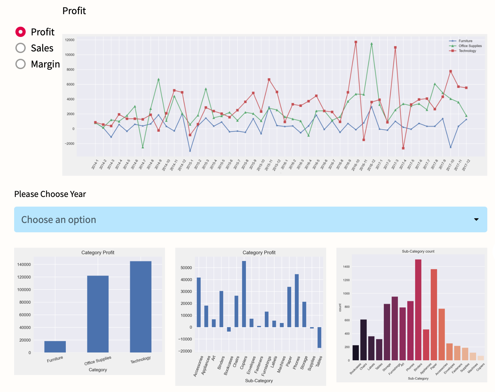

# Business analysis of Retail and shopping

### This app showed a detailed analysis of the Business of a store:
Including the **profit**, **margin**, **potential**, **weakness** within the four different aspect regarding the company.

## Notion For Using:
### packages needed:
import pandas as pd

import matplotlib.pyplot as plt

import seaborn as sns

import streamlit as st

from matplotlib import ticker as mtick
### Use **Anaconda Prompt** to open the app:
1. Use *cd* to get the path
2. Check the environment: conda activate...
3. Type *streamlit run main.py*  

### Page Select Demo:

The analysis is divided into four parts:
### Ship Mode Analysis
1. You can check the **Profit**, **Margin**, **Sales** for the Ship Mode through out the year with every month as unit.
2. You can check the numbers of transactions and profit of the Ship Mode business in whole scale.
2. There are analysis below for you to click and see.

Demo:

### Product Analysis
1. You can check the **Profit**, **Margin**, **Sales** for the Product through out the year with every month as unit.
2. You can check the profit and its strcuture of the Product business in whole scale and sub-categories.(years-select available)
3. There are analysis below for you to click and see.

Demo:

### Segment Analysis
1. You can check the **Profit**, **Margin**, **Sales** for the Segment through out the year with every month as unit.
2. You can check the profit and its strcuture of the Product business in whole scale and sub-categories.
3. You can select the number of profit to see the data of transactions that were profited beyond the number. 
4. You can search Customer ID to get the dataframe and see the total profit gained from the specific customer.
5. There are analysis below for you to click and see.

Demo:

### Region Analysis
1. You can check the **Profit**, **Margin**, **Sales** for the Cities and top 10 is shown.
2. You can check the **Profit**, **Margin**, **Sales** for the Cities in three product categories and top 5 is shown.
3. There are analysis below for you to click and see.

Demo:

## Deployed 
Click here to get to the deployed [Web App](https://william-debug-66-final-app-main-3ml2oc.streamlitapp.com/)

## Repository Structure
| Folder/Code | Content |
| ------------- | ------------- |
| .streamlit | Contains the confiq.toml to set certain design parameters |
| superstore | Contains the original data of the store in CSV format |
| main.py | Contains the actual Streamlit application |
| ...png | Photoshot for demo |
| ...jpeg | The cover of the app website |
| requirements.txt | Contains all requirements (necessary for Streamlit sharing) |
